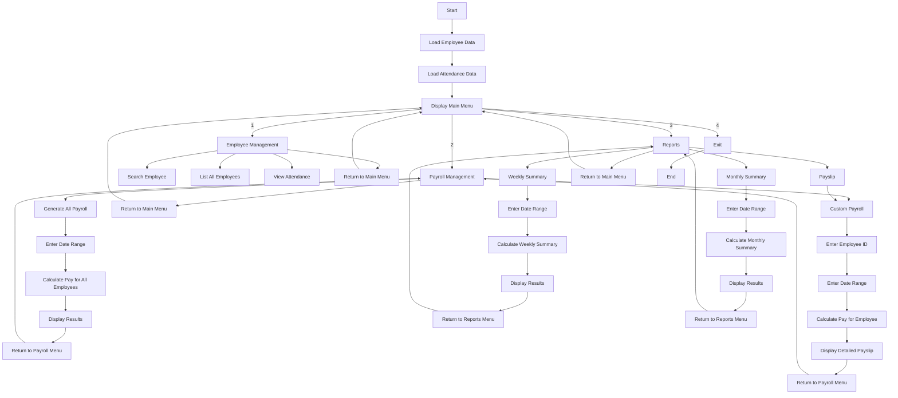
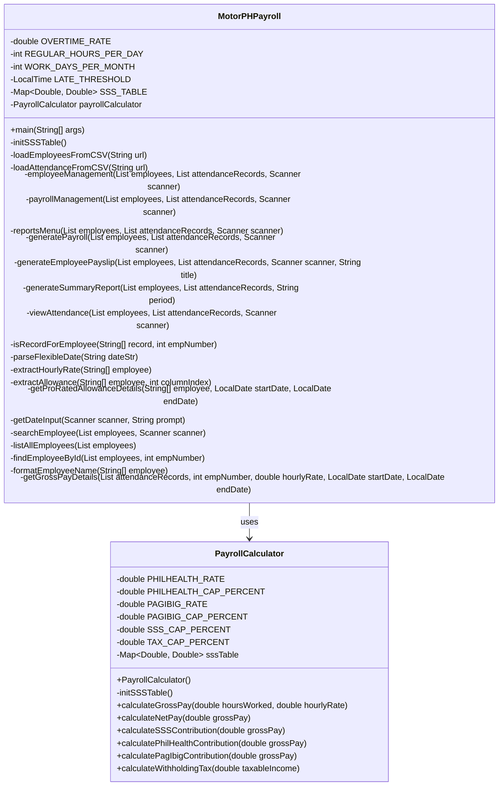
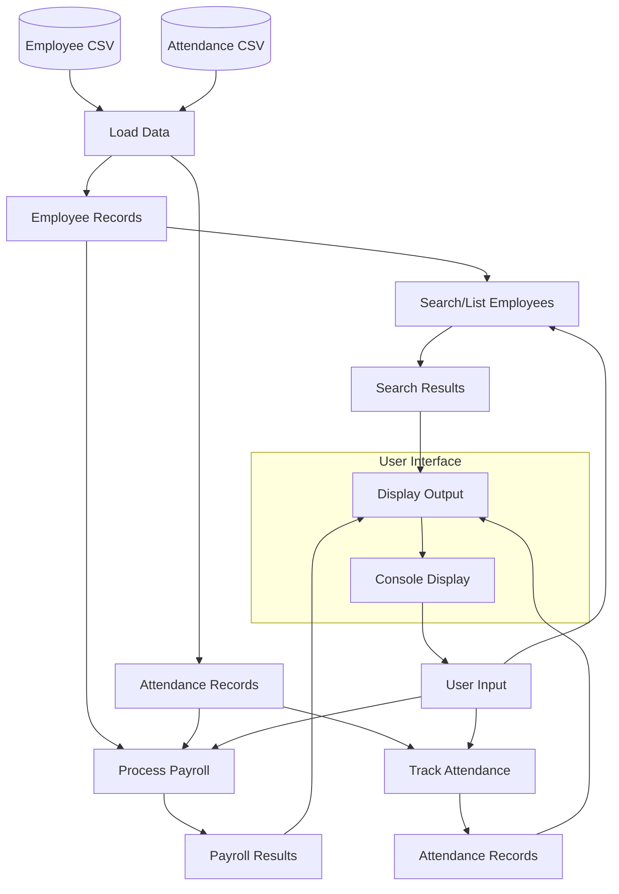
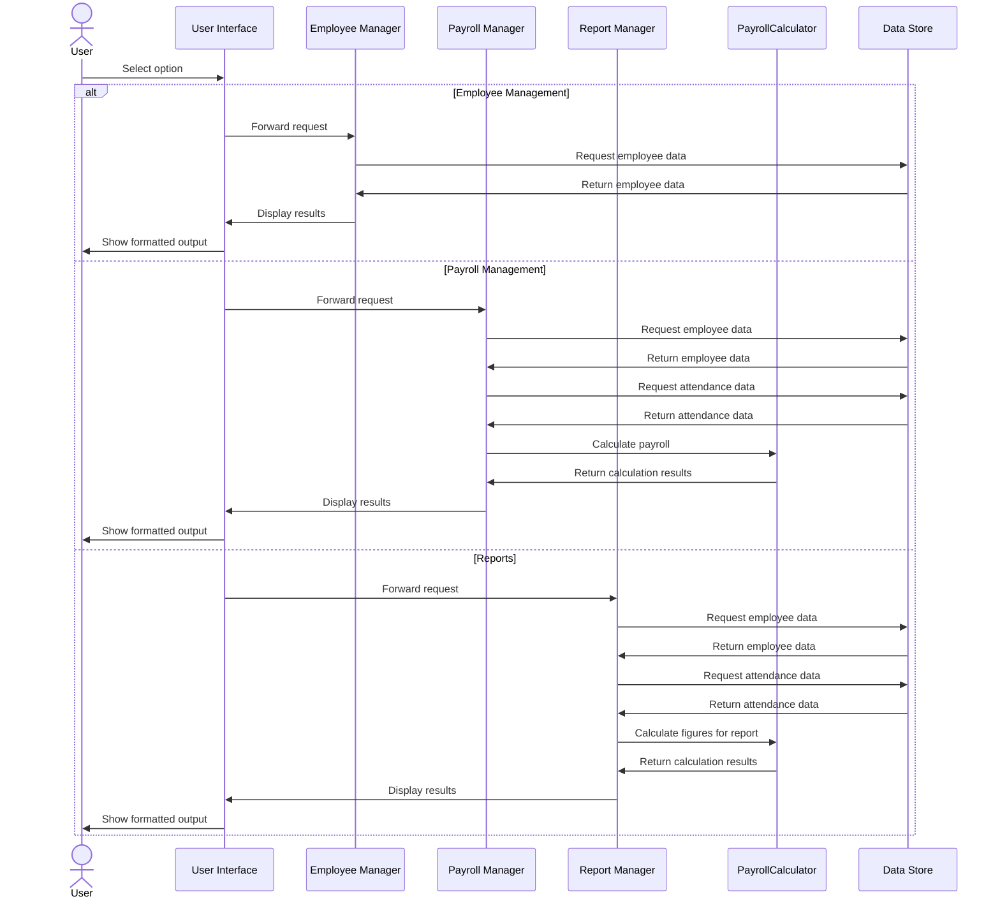

# MotorPH Payroll System - Documentation

## Table of Contents

1. System Overview
2. Logical Design
3. Calculation Logic & Formulas
4. System Flow Diagram
5. UML Class Diagram
6. Data Flow Diagram
7. Components Interaction
8. Business Rules

## System Overview

The MotorPH Payroll System is a comprehensive Java application designed to manage employee information, calculate payroll, and generate reports for MotorPH company. The system enables employee data management, payroll processing, and report generation.

Key features include:
- Employee search and listing
- Attendance tracking and reporting
- Payroll calculation with overtime and allowances
- Automated deduction calculation (SSS, PhilHealth, Pag-IBIG, withholding tax)
- Report generation (payslips, weekly and monthly summaries)

The application loads employee and attendance data from online CSV sources and processes this information to calculate pay and deductions according to Philippine payroll regulations.

## Logical Design

The MotorPH Payroll System is structured around several key modules:

### 1. Data Management Module
- Handles loading and parsing of employee and attendance data from CSV sources
- Stores data in memory as lists of string arrays
- Provides search and retrieval functionality

### 2. Payroll Processing Module
- Calculates gross pay based on regular hours and overtime
- Computes pro-rated allowances
- Applies mandatory deductions
- Determines final net pay

### 3. Reports Module
- Generates payslips for individual employees
- Creates weekly and monthly summary reports
- Formats and displays attendance records

### 4. User Interface Module
- Implements a console-based menu system
- Handles user input validation
- Displays formatted output

### 5. Utility Module
- Contains helper methods for date parsing, calculations, and formatting
- Implements the SSS contribution table
- Provides reusable functionality across modules

## Calculation Logic & Formulas

### Gross Pay Calculation

```
GrossPay = RegularPay + OvertimePay

Where:
- RegularPay = RegularHours × HourlyRate
- OvertimePay = OvertimeHours × HourlyRate × OVERTIME_RATE (1.25)
- RegularHours = Min(TotalHours, REGULAR_HOURS_PER_DAY)
- OvertimeHours = Max(0, TotalHours - REGULAR_HOURS_PER_DAY)
```

### Allowance Calculation

```
ProRatedAllowance = (FullMonthlyAllowance / WORK_DAYS_PER_MONTH) × EffectiveWorkingDays

Where:
- FullMonthlyAllowance = RiceSubsidy + PhoneAllowance + ClothingAllowance
- EffectiveWorkingDays = Min(ActualWorkingDays, WORK_DAYS_PER_MONTH)
- ActualWorkingDays = Number of weekdays in the selected period
```

### Deduction Calculation

```
TotalDeductions = SSS + PhilHealth + PagIBIG + WithholdingTax

Where:
- SSS = Based on SSS contribution table (determined by salary bracket)
- PhilHealth = (GrossPay × 0.03) / 2 (employee's share)
- PagIBIG = GrossPay × 0.02
- TaxableIncome = GrossPay - (SSS + PhilHealth + PagIBIG)
- WithholdingTax = Based on progressive tax table
```

### Net Pay Calculation

```
NetPay = GrossPay - TotalDeductions + TotalAllowances
```

### Progressive Tax Table

```
If TaxableIncome ≤ 2,083: Tax = 0
If 2,083 < TaxableIncome ≤ 33,333: Tax = (TaxableIncome - 2,083) × 0.20
If 33,333 < TaxableIncome ≤ 66,667: Tax = 6,250 + (TaxableIncome - 33,333) × 0.25
If 66,667 < TaxableIncome ≤ 166,667: Tax = 14,583.33 + (TaxableIncome - 66,667) × 0.30
If 166,667 < TaxableIncome ≤ 666,667: Tax = 44,583.33 + (TaxableIncome - 166,667) × 0.32
If TaxableIncome > 666,667: Tax = 204,583.33 + (TaxableIncome - 666,667) × 0.35
```

## System Flow Diagram



## UML Class Diagram



## Data Flow Diagram



## Components Interaction



## Business Rules

1. **Employee Classification**
   - Employees are classified by position and status
   - Different positions may have different default hourly rates

2. **Working Hours**
   - Regular working hours are 8 hours per day
   - Hours worked beyond 8 hours in a day are considered overtime
   - Overtime is paid at 1.25 times the regular hourly rate

3. **Allowances**
   - Employees receive rice subsidy, phone allowance, and clothing allowance
   - Allowances are pro-rated based on working days in the pay period
   - Standard working days per month is 21 days (excluding weekends)

4. **Attendance Rules**
   - An employee arriving after 8:10 AM is considered late
   - Attendance records track time in and time out
   - Only weekdays (Monday-Friday) are considered working days

5. **Deduction Rules**
   - SSS contributions follow the official SSS contribution table
   - PhilHealth contribution is 3% of gross pay (1.5% employee share)
   - Pag-IBIG contribution is 2% of gross pay
   - Withholding tax follows the progressive tax table

6. **Pay Calculation**
   - Gross pay includes regular pay and overtime pay
   - Net pay equals gross pay minus deductions plus allowances
   - Hourly rate is calculated from monthly salary if not directly available
   - Pay is calculated on a daily basis to accurately account for overtime