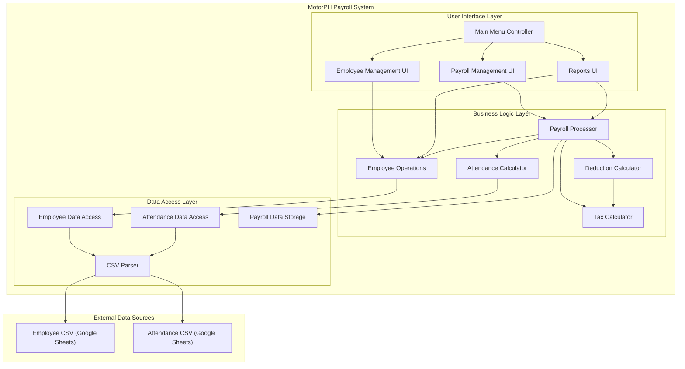
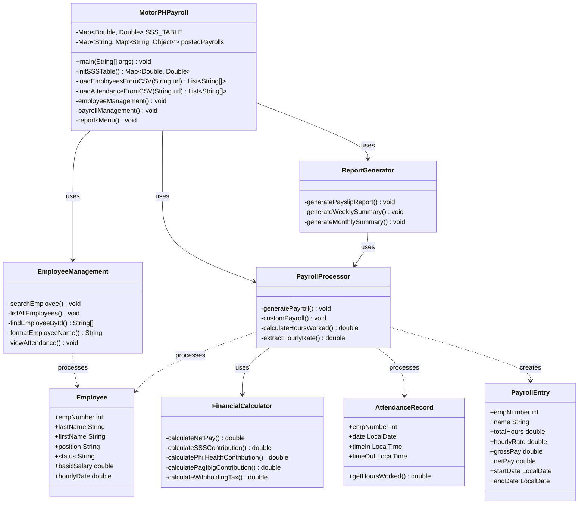
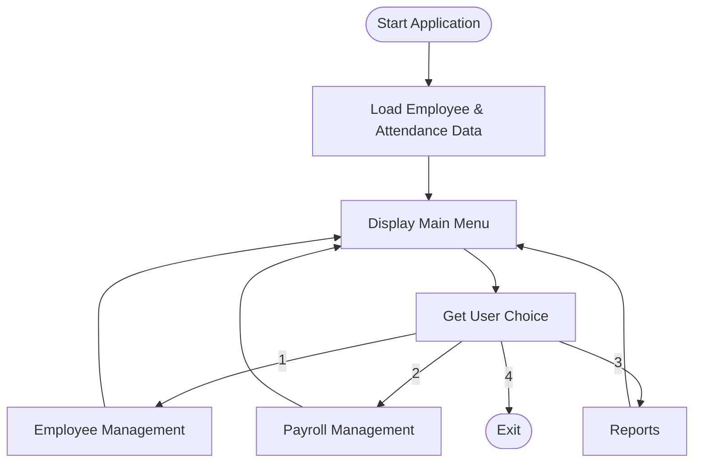
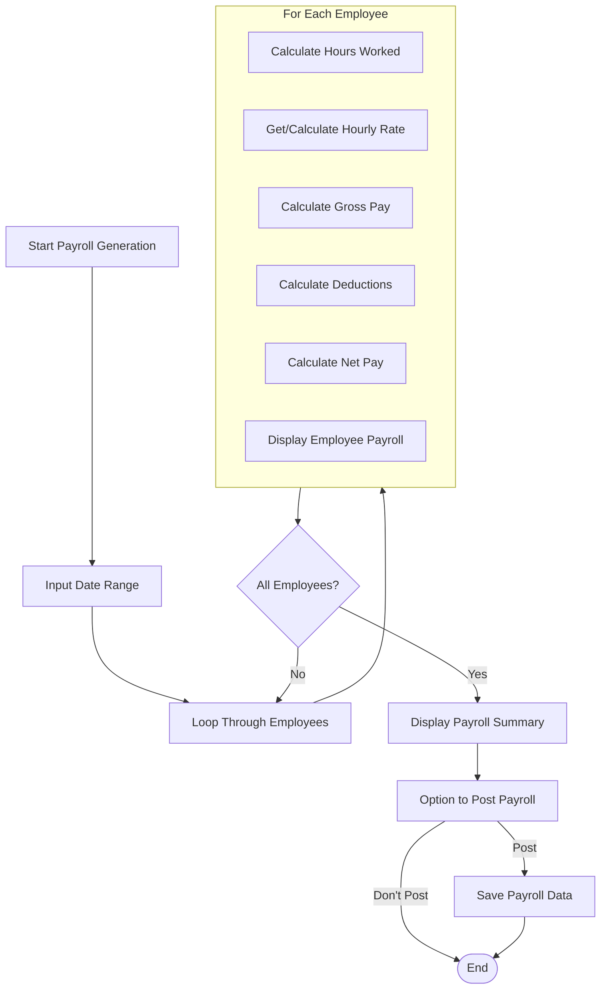
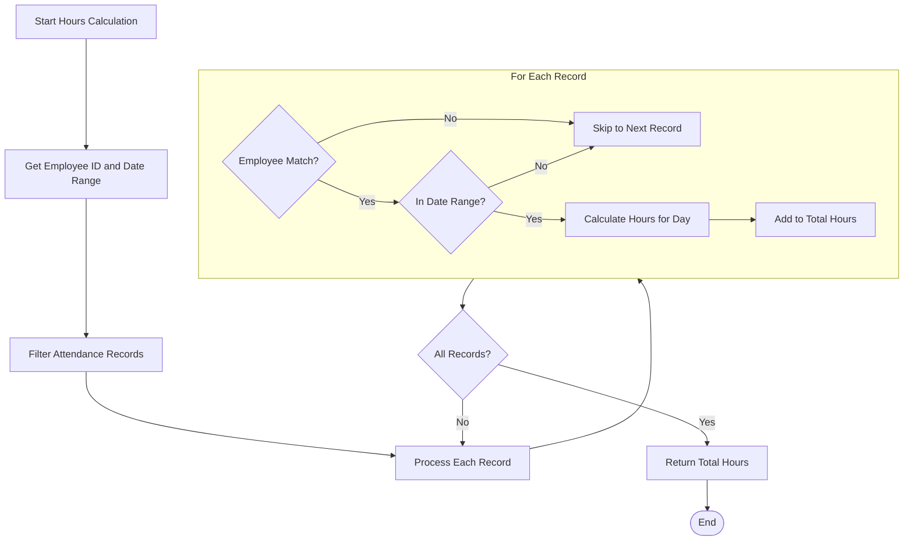
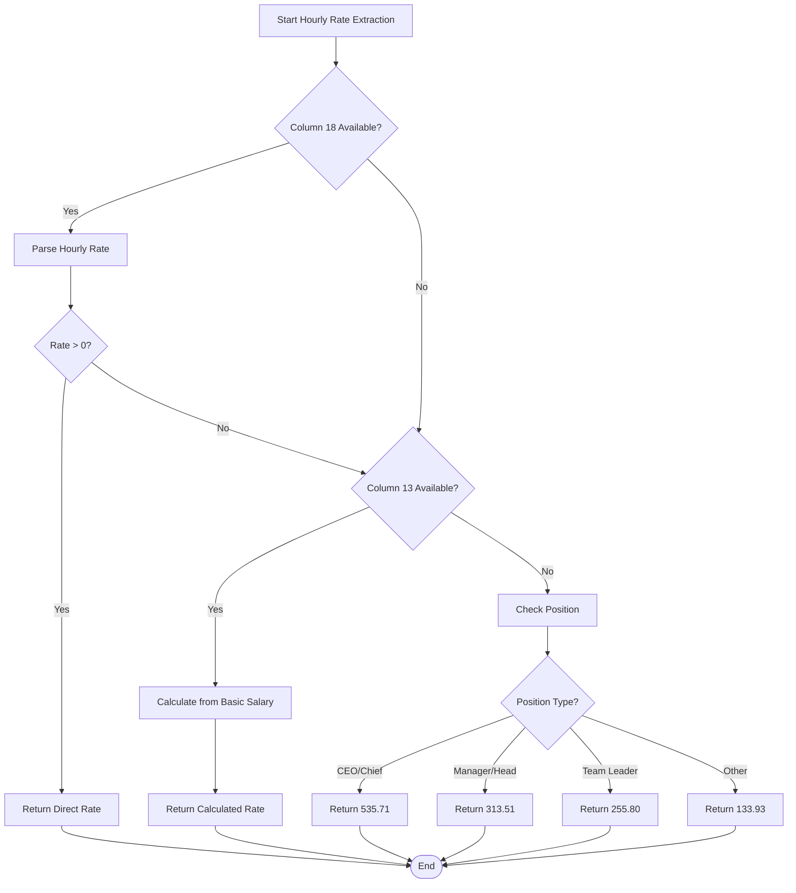
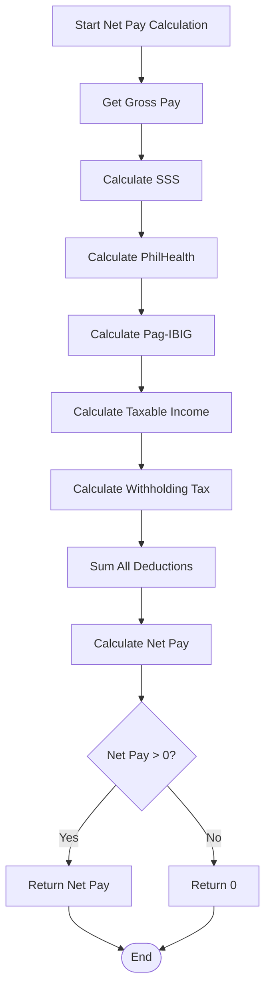
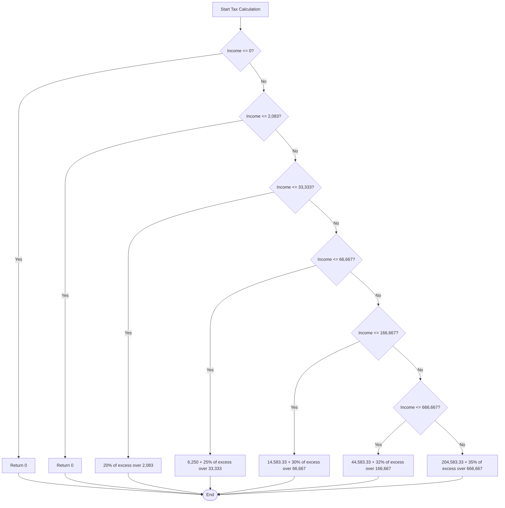

# System Design Document: MotorPH Payroll System

## 1. Introduction

### 1.1 Purpose

This document describes the design of the MotorPH Payroll System, a Java-based application that manages employee records, attendance tracking, payroll processing, and reporting for MotorPH company.

### 1.2 Scope

The system handles:

- Employee record management
- Attendance tracking and reporting
- Payroll calculation with mandatory deductions
- Payroll reporting (individual payslips, weekly/monthly summaries)

### 1.3 Definitions, Acronyms and Abbreviations

- **SSS**: Social Security System
- **PhilHealth**: Philippine Health Insurance Corporation
- **Pag-IBIG**: Home Development Mutual Fund
- **CSV**: Comma-Separated Values
- **URL**: Uniform Resource Locator
- **UML**: Unified Modeling Language

## 2. System Architecture

### 2.1 Overview

The MotorPH Payroll System uses a single-tier architecture implemented in Java. The system is console-based with modular components handling different aspects of payroll processing.

### 2.2 Architectural Diagram



### 2.3 Component Description

#### 2.3.1 Main Controller (MotorPHPayroll class)

Provides the main execution flow and menu system.

#### 2.3.2 Data Access Layer

- `loadEmployeesFromCSV()`: Fetches and parses employee data
- `loadAttendanceFromCSV()`: Fetches and parses attendance records
- `findEmployeeById()`: Retrieves specific employee data

#### 2.3.3 Employee Management Module

- `employeeManagement()`: Entry point for employee management features
- `searchEmployee()`: Search functionality by name or employee number
- `listAllEmployees()`: Display all employee records
- `viewAttendance()`: View attendance for a specific employee

#### 2.3.4 Payroll Processing Module

- `payrollManagement()`: Entry point for payroll features
- `generatePayroll()`: Generate payroll for all employees
- `customPayroll()`: Generate payroll for a specific employee
- `calculateHoursWorked()`: Calculate total hours worked
- `extractHourlyRate()`: Extract or calculate hourly rate
- `calculateNetPay()`: Calculate net pay with mandatory deductions

#### 2.3.5 Reporting Module

- `reportsMenu()`: Entry point for reporting features
- `generatePayslipReport()`: Generate individual payslips
- `generateWeeklySummary()`: Generate weekly payroll summary
- `generateMonthlySummary()`: Generate monthly payroll summary

#### 2.3.6 Deduction Calculator

- `calculateSSSContribution()`: Calculate SSS contributions
- `calculatePhilHealthContribution()`: Calculate PhilHealth contributions
- `calculatePagIbigContribution()`: Calculate Pag-IBIG contributions
- `calculateWithholdingTax()`: Calculate withholding tax based on tax brackets

## 3. Data Design

### 3.1 Data Sources

- **Employee Data CSV**: Contains employee personal information, salary details
- **Attendance Records CSV**: Contains daily time-in/time-out records

### 3.2 Data Models

#### 3.2.1 Employee Record Structure

```
[0] Employee Number
[1] Last Name
[2] First Name
[3] Middle Name (optional)
...
[10] Status
[11] Position
...
[13] Basic Salary
...
[18] Hourly Rate
```

#### 3.2.2 Attendance Record Structure

```
[0] Employee Number
...
[3] Date (M/d/yyyy format)
[4] Time In (H:mm format)
[5] Time Out (H:mm format)
```

#### 3.2.3 Payroll Entry Structure

- Employee Number
- Name
- Total Hours Worked
- Hourly Rate
- Gross Pay
- Net Pay
- Start Date
- End Date

### 3.3 In-Memory Data Storage

- `employees`: List of employee records
- `attendanceRecords`: List of attendance records
- `postedPayrolls`: Map of processed payroll entries, keyed by employee ID + date range

### 3.4 UML Class Diagram



## 4. Process Flow Diagrams

### 4.1 Main Menu Flow



### 4.2 Payroll Generation Flow



### 4.3 Attendance Calculation Flow



## 5. System Logic Design

### 5.1 Hourly Rate Determination Logic



### 5.2 Deduction Calculation Logic



### 5.3 Tax Bracket Determination



## 6. Interface Design

### 6.1 User Interface

The system implements a console-based text menu interface with the following structure:

```
Main Menu
├── Employee Management
│   ├── Search Employee
│   ├── List All Employees
│   └── Attendance
├── Payroll Management
│   ├── Generate Payroll
│   └── Custom Payroll
└── Reports
    ├── Payslip
    ├── Weekly Summary
    └── Monthly Summary
```

### 6.2 External Interfaces

#### 6.2.1 Data Input

- Employee data fetched from Google Sheets CSV (via HTTPS)
- Attendance data fetched from Google Sheets CSV (via HTTPS)

## 7. Processing Design

### 7.1 CSV Parsing Process

The system uses two different CSV parsing approaches:

1. **Employee Data**: Custom parser to handle quotes and commas within fields

   ```java
   List<String> fields = new ArrayList<>();
   StringBuilder sb = new StringBuilder();
   boolean inQuotes = false;

   for (char c : line.toCharArray()) {
       if (c == '"') {
           inQuotes = !inQuotes; // Toggle quote state
       } else if (c == ',' && !inQuotes) {
           // End of field
           fields.add(sb.toString());
           sb = new StringBuilder();
       } else {
           sb.append(c);
       }
   }
   ```
2. **Attendance Data**: Simple split for comma-separated values

   ```java
   String[] data = line.split(",");
   ```

### 7.2 Error Handling Strategy

The system uses try-catch blocks for error handling:

1. **Data Loading Errors**: Caught and propagated up for user notification
2. **Input Parsing Errors**: Handled with user prompts for correct input
3. **Calculation Errors**: Silently handled with fallback to default values

## 8. Non-Functional Requirements

### 8.1 Performance

- In-memory data processing for fast calculations
- Efficient parsing of CSV data with minimal memory overhead

### 8.2 Maintainability

- Modular design with separate method responsibilities
- Consistent error handling patterns
- Well-commented code

### 8.3 Security

- No local data storage (transient in-memory only)
- Read-only access to external data sources

## 9. Limitations and Future Enhancements

### 9.1 Current Limitations

- No persistent storage for posted payrolls (lost on program exit)
- Limited to console-based interface
- No authentication or user roles
- No functionality to modify employee or attendance records

### 9.2 Future Enhancements

- Database integration for persistent storage
- GUI implementation
- User authentication system
- Advanced reporting capabilities
- Payroll editing functionality
- Employee and attendance record management
- Export reports to PDF or Excel

## 10. Conclusion

The MotorPH Payroll System provides a functional console-based solution for managing payroll operations. Its modular design allows for future enhancements while maintaining core payroll calculation functionality. The UML diagrams, process flows, and logic designs provided in this document serve as a comprehensive reference for understanding the system's architecture, behavior, and implementation details.

The system effectively handles CSV data parsing, attendance calculation, and Philippine-specific deduction rules to provide accurate payroll processing, with special attention given to edge cases such as missing data and calculation errors through robust fallback mechanisms.
